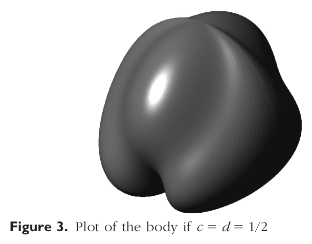
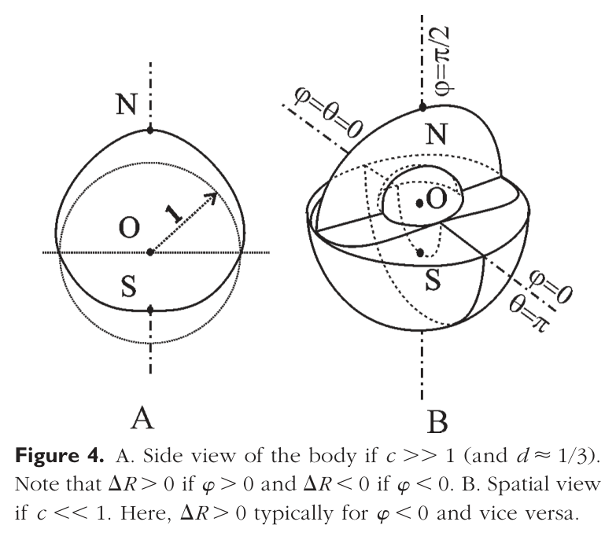
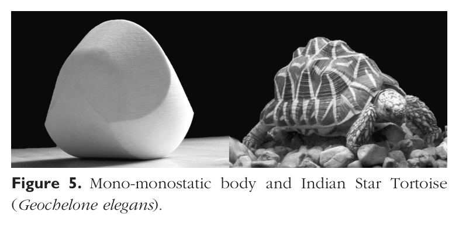

# Mono-monostatic Bodies: The Answer to Arnold's Question

## Source

P. L. Várkonyi and G. Domokos, "Mono-monostatic Bodies: The Answer to
Arnold's Question," *The Mathematical Intelligencer* **28** (2006), no. 4,
34–38. © 2006 Springer Science+Business Media, Inc.

Authors' affiliations at the time: G. Domokos — Department of Mechanics,
Materials and Structures, Budapest University of Technology and Economics,
Budapest, Hungary. P. L. Várkonyi — Program in Applied and Computational
Mathematics, Princeton University, Princeton, NJ, USA.

This is the *Mathematical Intelligencer* announcement of the **gömböc**: the
first explicit homogeneous, convex body with exactly two equilibria (one
stable, one unstable). The detailed proofs are in reference [7] (Várkonyi &
Domokos, *J. Nonlinear Science* **16** (2006), 251–283).

---

## Do Mono-monostatic Bodies Exist?

In his problem collection [11], V. I. Arnold gathered problems from his Moscow
seminars. As Tabachnikov notes in his review [12], a recurring theme is the
geometric/topological generalization of the classical **Four-Vertex Theorem**
[2] — that a plane curve has at least four extrema of curvature. Many problems
in the book reduce to the assertion that "some integer is at least four."
Arnold made this a theme of his 1995 plenary lecture at the International
Conference on Industrial and Applied Mathematics in Hamburg.

The number of equilibria of a homogeneous rigid body is a tempting candidate
for another "at least four" statement (and in the planar case it is provably
true [1]). Arnold instead conjectured that the three-dimensional case is an
exception: that convex, homogeneous bodies with **fewer than four** equilibria
— **mono-monostatic** bodies — can exist. The conjecture turned out to be
correct.

## Why Are They Special?

Consider bodies resting on a horizontal plane under uniform gravity. A body
with a single stable equilibrium is **monostatic**. Monostatic bodies are easy
to build if inhomogeneous (e.g. the "Comeback Kid" toy, Figure 1A), but
homogeneous convex monostatic bodies are far harder to find.

In 2D one can prove [1] that among planar (slab-like) convex homogeneous
objects rolling on their circumference, **no** monostatic body exists — a
statement equivalent to the Four-Vertex Theorem [2].

**The 2D impossibility proof (sketch).** Take a convex homogeneous planar body
$B$ and place the origin $O$ of a polar coordinate system at its center of
gravity. Let the continuous function $R(\varphi)$ describe the boundary. As
shown in [1], non-degenerate stable/unstable equilibria correspond to local
minima/maxima of $R(\varphi)$. Suppose $R(\varphi)$ has exactly one local
maximum and one local minimum. Then there is exactly one value $\varphi_0$ with
$R(\varphi_0) = R(\varphi_0 + \pi)$; moreover $R(\varphi) > R(\varphi_0)$ for
$\varphi_0 < \varphi < \varphi_0 + \pi$ and $R(\varphi) < R(\varphi_0)$ for
$\varphi_0 - \pi < \varphi < \varphi_0$ (see Figure 2A). The line
$\varphi = \varphi_0$ (identical to $\varphi = \varphi_0 + \pi$) through the
origin cuts $B$ into a "thin" half ($R < R(\varphi_0)$) and a "thick" half
($R > R(\varphi_0)$). The center of gravity must then lie on the thick side, so
it cannot be at $O$ — contradicting the assumption.

*Figure 1. A. Children's toy with one stable and one unstable equilibrium
(inhomogeneous, mono-monostatic body), also called the "comeback kid." B.
Convex, homogeneous solid body with one stable equilibrium (monostatic body).
In both plots, S, D, and U denote points of the surface corresponding to
stable, saddle-type, and unstable equilibria of the bodies, respectively.*

![Figure 2. A. Example of a convex, homogeneous, planar body bounded by R(phi) (polar distance from the origin O). Assuming R(phi) has only two local extrema, the body can be cut to a "thin" and a "thick" half by the line phi = phi_0. Its center of gravity is on the "thick" side, in particular, it cannot coincide with O. B. 3D body (dashed line) separated into a "thin" and a "thick" part by a tennis ball-like space curve C (dotted line) along which R = R_0. Continuous line shows a sphere of radius R_0, which also contains the curve C.](figures/monostatic_bodies_2006-fig-p2-2.png)

*Figure 2. A. Example of a convex, homogeneous, planar body bounded by
$R(\varphi)$ (polar distance from the origin $O$). Assuming $R(\varphi)$ has
only two local extrema, the body can be cut to a "thin" and a "thick" half by
the line $\varphi = \varphi_0$. Its center of gravity is on the "thick" side,
in particular, it cannot coincide with $O$. B. 3D body (dashed line) separated
into a "thin" and a "thick" part by a tennis ball-like space curve $C$ (dotted
line) along which $R = R_0$. Continuous line shows a sphere of radius $R_0$,
which also contains the curve $C$.*

The 3D situation is more subtle. A homogeneous convex monostatic body does
exist (Figure 1B), but building a monostatic **polyhedron** with a minimal
number of faces is hard: Conway and Guy [3] found one with 19 faces (still
believed minimal); Heppes [6] showed no homogeneous monostatic **tetrahedron**
exists; Dawson [4] found homogeneous monostatic simplices in $d \ge 7$
dimensions; Dawson and Finbow [5] found monostatic tetrahedra with
**inhomogeneous** mass density.

**Classification by equilibria.** Bodies with only non-degenerate balance
points are classified by the number and type of their equilibria. In 2D, stable
and unstable equilibria occur in pairs, so a body is in class $\{i\}$
($i > 0$) if it has exactly $S = i$ stable (hence $U = i$ unstable) equilibria;
class $\{1\}$ is empty (shown above). In 3D, the **Poincaré–Hopf Theorem** [8]
gives, for convex bodies,

$$S - U + D = 2, \tag{$\ast$}$$

where $S$, $U$, $D$ are the numbers of local minima, maxima, and saddles of the
body's potential energy. Class $\{i,j\}$ ($i,j > 0$) then contains all bodies
with $S = i$ stable, $U = j$ unstable, and $D = i + j - 2$ saddle-type
equilibria.

Monostatic bodies lie in classes $\{1,j\}$; the extreme class $\{1,1\}$ (one
stable, one unstable equilibrium — hence, by $(\ast)$, **zero saddles**) is
called **mono-monostatic**. In 2D, monostatic $\Leftrightarrow$
mono-monostatic. In 3D a monostatic body may have any number of unstable
equilibria — e.g. the body in Figure 1B is in class $\{1,2\}$ (four equilibria
total). Arnold's conjecture was that class $\{1,1\}$ is **not** empty.

## Special Status Among Convex Bodies

Small local perturbations to a surface can create additional local maxima and
minima near existing ones (the "egg of Columbus": Columbus stood an egg on end
by crushing its tip slightly). In [7] the authors show that, analogously, one
can **add** stable and unstable equilibria one at a time by removing small
local portions of a body. The inverse operation is generally impossible: for a
typical body one cannot **reduce** the number of equilibria by small
perturbations.

This gives mono-monostatic bodies a special status. Given a typical
mono-monostatic body, one can find bodies in an arbitrary class $\{i,j\}$ with
almost the same shape. But conversely, to a typical member of class $\{i,j\}$
with $i, j > 1$ one **cannot** find a nearby mono-monostatic body. This helps
explain why mono-monostatic bodies are rare in Nature and hard to visualize.

## What Are They Like? — The Explicit Construction

As in the planar case, a mono-monostatic 3D body can be cut into a "thin" and a
"thick" part by a closed curve on its boundary along which $R(\theta,\varphi)$
is constant. If this **separatrix** is planar, one gets the same contradiction
as in 2D. But if the separatrix is a **generic spatial curve** — like the seam
on a tennis ball (Figure 2B) — the argument fails: the "upper" thick part is
partially below the equator and the "lower" thin part partially above it, so
the center of gravity can sit at the origin. The construction below is of this
tennis-ball-seam type.

### Coordinate system and parameters

Work in spherical coordinates $(r, \theta, \varphi)$ where:

- $\varphi$ is the **latitude** with $-\pi/2 < \varphi < \pi/2$ (and the two
  poles $\varphi = \pm\pi/2$, which carry no $\theta$ coordinate);
- $\theta$ is the **longitude** with $0 \le \theta \le 2\pi$;
- $c > 0$ and $0 < d < 1$ are the two shape parameters.

Define a two-parameter family of surfaces $R(\theta, \varphi, c, d)$ decomposed
as

$$R(\theta,\varphi,c,d) = (1 + d) \cdot \Delta R(\theta,\varphi,c). \tag{1}$$

> **Transcription note (important for a generator).** Equation (1) is printed
> in the paper exactly as above, but the surrounding text repeatedly writes the
> surface as $R = 1 + d\,\Delta R$ (e.g. "the constructed surface
> $R = 1 + d\,\Delta R$"). The form $R = 1 + d\,\Delta R$ is the physically
> correct one: since $\Delta R = -1$ at the south pole (eq. (6)), the printed
> $(1+d)\cdot\Delta R$ would give a **negative** radius there, whereas
> $1 + d\,\Delta R$ gives radii in $[\,1-d,\,1+d\,]$ — a small, positive
> deviation from the unit sphere, matching the text's statements that
> "$\Delta R$ denotes the type of deviation from the unit sphere," that "$d$ is
> a measure of how far the surface is from the sphere," and that
> "$R = 1 + d\,\Delta R$." **Use $R(\theta,\varphi) = 1 + d\,\Delta R(\theta,\varphi,c)$.**

Here $\Delta R$ is the *type* of deviation from the unit sphere. The "thin" and
"thick" parts correspond to $\Delta R < 0$ and $\Delta R > 0$ respectively, so
the separatrix between them is the curve $\Delta R = 0$. The parameter $d$
measures how far the surface is from the sphere; small $d$ keeps it convex.

### Defining $\Delta R$

The extrema of $\Delta R$ (values $\Delta R = \pm 1$) sit at the North/South
poles ($\varphi = \pm\pi/2$). The parameter $c$ controls the shape of the thick
and thin portions: for $c \gg 1$ the separatrix approaches the equator; for
smaller $c$ it becomes tennis-ball-like.

**Step 1 — the latitude-warping map.** Introduce a smooth one-parameter map
$f(\varphi, c): (-\pi/2, \pi/2) \to (-\pi/2, \pi/2)$:

$$f(\varphi,c) = \pi \cdot \left[ \frac{e^{\left[\frac{\varphi}{\pi c} + \frac{1}{2c}\right]} - 1}{e^{1/c} - 1} - \frac{1}{2} \right]. \tag{2}$$

(Check: at $\varphi = -\pi/2$ the bracket exponent is $0$, giving
$f = -\pi/2$; at $\varphi = +\pi/2$ the exponent is $1/c$, giving $f = +\pi/2$.
So $f$ is a monotone reparametrization of the latitude interval onto itself.)
For $c \gg 1$ this map is almost the identity; for $c$ near $0$ it deviates
strongly from linearity.

**Step 2 — two profile functions.** From $f$, define

$$f_1(\varphi,c) = \sin\big(f(\varphi,c)\big) \tag{3}$$

and

$$f_2(\varphi,c) = -f_1(-\varphi,c) = -\sin\big(f(-\varphi,c)\big). \tag{4}$$

These are the target radial-deviation profiles used on different meridians:
$\Delta R = f_2(\varphi,c)$ is wanted on the meridians $\theta = \pi/2$ or
$3\pi/2$ (large parts of these sections lie in the thick part, cf. Figure 2B),
and $\Delta R = f_1(\varphi,c)$ on the meridians $\theta = 0$ or $\pi$ (mostly
in the thin part).

**Step 3 — the longitude blending weight.** A weight function $a(\theta,
\varphi, c)$ blends $f_1$ and $f_2$ as $\theta$ varies:

$$a(\theta,\varphi,c) = \frac{\cos^2(\theta)\,(1 - f_1^{\,2})}{\cos^2(\theta)(1 - f_1^{\,2}) + \sin^2(\theta)\,(1 - f_2^{\,2})} = \frac{1}{\,1 + \tan^2(\theta)\,\dfrac{\cos^2\!\big(f(-\varphi,c)\big)}{\cos^2\!\big(f(\varphi,c)\big)}\,}, \qquad |\varphi| < \tfrac{\pi}{2}. \tag{5}$$

> **Transcription note.** The two forms of eq. (5) are equal because
> $1 - f_1^{\,2} = \cos^2\!\big(f(\varphi,c)\big)$ and
> $1 - f_2^{\,2} = \cos^2\!\big(f(-\varphi,c)\big)$ (from (3)–(4)). The **printed**
> second form has a typographical error: it renders the numerator inside the
> ratio as $\cos^2(f(\varphi,c))$, identical to the denominator, which would
> make the ratio $\equiv 1$ and contradict the first (definitional) form. (This
> is exactly the spot flagged by the journal's editorial query "QU1" on the
> page.) The **first form of (5) is authoritative**; the corrected second form,
> with numerator $\cos^2\!\big(f(-\varphi,c)\big)$, is shown above.

**Step 4 — assemble $\Delta R$** as the weighted average of $f_1$ and $f_2$:

$$\Delta R(\theta,\varphi,c) = \begin{cases} a\cdot f_1 + (1 - a)\cdot f_2 & \text{if } |\varphi| < \tfrac{\pi}{2} \\[2pt] 1 & \text{if } \varphi = \tfrac{\pi}{2} \\[2pt] -1 & \text{if } \varphi = -\tfrac{\pi}{2} \end{cases} \tag{6}$$

with $a = a(\theta,\varphi,c)$ and $f_1 = f_1(\varphi,c)$,
$f_2 = f_2(\varphi,c)$ as above. The choice of $a$ guarantees (i) a gradual
transition from $f_1$ to $f_2$ as $\theta$ runs from $0$ to $\pi/2$, and (ii)
the desired thick/thin geometry (Figure 2B).

The surface $R$ defined by (1)–(6) is plotted in Figure 3 for intermediate
$c, d$. For $c \gg 1$, the surface $R = 1 + d\,\Delta R$ is split by the
equator $\varphi = 0$ into two unequal halves: the upper ($\varphi > 0$) half
is "thick" ($R > 1$) and the lower ($\varphi < 0$) half is "thin" ($R < 1$). As
$c$ decreases, the dividing line becomes a space curve; the thick portion moves
downward and the thin portion upward. As $c \to 0$, the upper half becomes thin
and the lower half thick (Figure 4).

*Figure 3. Plot of the body if $c = d = 1/2$.*

*Figure 4. A. Side view of the body if $c \gg 1$ (and $d \approx 1/3$). Note
that $\Delta R > 0$ if $\varphi > 0$ and $\Delta R < 0$ if $\varphi < 0$. B.
Spatial view if $c \ll 1$. Here, $\Delta R > 0$ typically for $\varphi < 0$ and
vice versa.*

### Existence result and how sphere-like it is

In [7] the authors prove analytically that there exist ranges of $c$ and $d$
for which the body is convex **and** its center of gravity is at the origin —
i.e. it is in class $\{1,1\}$. Numerical study shows that $d$ must be **very
small** to satisfy convexity together with the other constraints:

$$d < 5 \cdot 10^{-5},$$

so this constructed object is **extremely close to a sphere**. In the admitted
range of $d$, the companion parameter is approximately

$$c \approx 0.275.$$

In other words, the explicit two-parameter body of eqs. (1)–(6), at parameters
in the class-$\{1,1\}$ regime, deviates from the unit sphere by less than
$5 \cdot 10^{-5}$ in radius — visually indistinguishable from a ball. (A very
different-looking, strongly non-spherical mono-monostatic shape — the one that
resembles a tortoise — is discussed at the end but is **not** given by an
explicit formula in this paper.)

## What Are They Not Like?

Intuitively a mono-monostatic body can be neither very flat (which would force
$\ge 2$ stable equilibria) nor very thin (which would force $\ge 2$ unstable
equilibria). To make this precise, define **flatness** $F$ and **thinness** $T$.
Draw a closed curve $c$ on the surface, traced by the position vector $R(s)$,
$s \in [0,1]$, from the center of gravity $O$. Pick two points $P_i$ ($i=1,2$)
on opposite sides of $c$, with position vectors $R_i$. Define

$$F = \sup_{c,\,P_1,P_2} \frac{\min_i(R_i)}{\min_s\big(R(s)\big)}, \qquad T = \sup_{c,\,P_1,P_2} \frac{\max_s\big(R(s)\big)}{\max_i(R_i)}.$$

Although $F$ and $T$ are hard to compute in general, there is a universal lower
bound

$$F, T \ge 1, \tag{7}$$

because $F = T = 1$ is obtained by shrinking $c$ to a point. For simple bodies
$F$ and $T$ agree well with intuition (Table 1).

$F$ and $T$ are tied to the equilibrium counts by:

> **Lemma 1.** (a) $F > 1$ if and only if $S > 1$, and
> (b) $T > 1$ if and only if $U > 1$.

*Proof of (a) (b analogous).* If $S > 1$, the radius $R$ has a global minimum
and at least one further local minimum. Take $c$ to be a closed curve
$R = R_0 = \text{const}$ circling the local minimum tightly, and let $P_1, P_2$
be the global and local minima. Then $R_1, R_2 \ge R_0$ and
$\min_s(R(s)) < R_0$, $\max_i(R_i) \ge R_2$, giving $F > 1$. Conversely if
$S = 1$, $R$ has a unique minimum, so on one side of any curve $c$ it only takes
values $\ge \min_s(R(s))$, giving $F \le 1$; with (7), $F = 1$. $\quad\blacksquare$

So mono-monostatic bodies have **simultaneously minimal flatness and thinness**
($F = T = 1$), and are the only non-degenerate bodies with this property.

**Table 1.** Flatness $F$ and thinness $T$ of some "simple" objects.

| Body | Flatness $F$ | Thinness $T$ |
|---|---|---|
| Sphere | $1$ | $1$ |
| Regular tetrahedron | $3$ | $3$ |
| Cube | $2$ | $\sqrt{3/2}$ |
| Octahedron | $\sqrt{3/2}$ | $2$ |
| Cylinder, radius $r$, height $2h$, $z = \sqrt{r^2 + h^2}$ | $z/h$ | $z/r$ |
| Ellipsoid with axes $a > b > c$ | $b/a$ | $c/b$ |

Another "negative" feature is the apparent lack of a simple **polyhedral
approximation**. One can generalize the search for minimal-face monostatic
polyhedra [3]–[6] to minimal-face polyhedra in class $\{i,j\}$. A sufficiently
fine triangulation of a smooth class-$\{i,j\}$ body (vertices at unstable
equilibria, edges at saddles, faces at stable equilibria) may "inherit" the
class. If the topological inequalities

$$2i - j \le 4 \quad\text{and}\quad 2j - i \le 4$$

hold, "minimal" polyhedra are possible where #faces $= S$, #vertices $= U$,
#edges $= D$. Classes violating these inequalities (monostatic ones among them)
are much more puzzling. In particular, the minimal number of faces of a class
$\{1,1\}$ polyhedron is unknown; because a smooth mono-monostatic body is so
close to a sphere, its equilibrium count is very sensitive to perturbation, so
the minimal face count may be very large.

## Mono-monostatic Bodies Do Exist

Arnold's conjecture is confirmed: homogeneous convex bodies with exactly two
equilibria — mono-monostatic bodies — exist. They are hard to visualize,
hard to describe, and hard to identify: their form resembles no typical member
of any other class; they are the unique non-degenerate bodies with minimal
flatness and thinness simultaneously; and their polyhedral approximations may
need very many faces. Their extreme sensitivity to abrasion was confirmed by
pebble statistics [7]: among 2000 pebbles, not a single mono-monostatic object
was found.

Nature, however, appears to exploit the property: being monostatic can be
life-saving for hard-shelled land animals (beetles, turtles), whose "righting
response" is a fitness measure [9], [10]. While the sphere-like example above
is practically indistinguishable from a ball, the mono-monostatic class also
contains strongly non-spherical shapes. The authors identified and 3D-printed
one such body that resembles some turtles and beetles; Figure 5 compares it to
an Indian Star Tortoise (*Geochelone elegans*). The analogy is incomplete —
turtles are neither homogeneous nor exactly mono-monostatic (their righting is
aided dynamically by limb motion) — but the resemblance is probably not
coincidental, since such forms are unlikely to arise by chance.

*Figure 5. Mono-monostatic body and Indian Star Tortoise (Geochelone
elegans).*

## Acknowledgement

The support of OTKA grant TS49885 is gratefully acknowledged.

## References

1. G. Domokos, J. Papadopoulos, A. Ruina: Static equilibria of planar, rigid
   bodies: is there anything new? *J. Elasticity* **36** (1994), 59–66.
2. M. Berger, B. Gostiaux: *Differential Geometry: Manifolds, Curves and
   Surfaces.* Springer, New York (1988).
3. J. H. Conway and R. Guy: Stability of polyhedra, *SIAM Rev.* **11** (1969),
   78–82.
4. R. Dawson: Monostatic simplexes, *Amer. Math. Monthly* **92** (1985),
   541–646.
5. R. Dawson and W. Finbow: What shape is a loaded die? *Mathematical
   Intelligencer* **22** (1999), 32–37.
6. A. Heppes: A double-tipping tetrahedron, *SIAM Rev.* **9** (1967), 599–600.
7. P. L. Várkonyi and G. Domokos: Static equilibria of rigid bodies: dice,
   pebbles and the Poincaré–Hopf Theorem. *J. Nonlinear Science* **16** (2006),
   251–283.
8. V. I. Arnold: *Ordinary Differential Equations*, 10th printing, 1998. MIT
   Press.
9. S. Freedberg et al.: Developmental environment has long-lasting effects on
   behavioral performance in two turtles with environmental sex determination.
   *Evolutionary Ecology Res.* **6** (2004), 739–747.
10. A. C. Steyermark, J. R. Spotila: Body temperature and maternal identity
    affect snapping turtle (*Chelydra serpentina*) righting response. *COPEIA*
    **4** (2001), 1050–1057.
11. V. I. Arnold: *Arnold's Problems.* Springer, Berlin-Heidelberg-New York &
    PHASIS, Moscow, 2005.
12. S. Tabachnikov: Review of *Arnold's Problems*. *The Mathematical
    Intelligencer*, to appear.

---

## Construction summary (for a generator)

The explicit near-spherical mono-monostatic surface, in spherical coordinates
$(\theta, \varphi)$ with longitude $\theta \in [0, 2\pi)$ and latitude
$\varphi \in (-\pi/2, \pi/2)$, radius:

$$R(\theta,\varphi) = 1 + d\,\Delta R(\theta,\varphi,c),$$

$$\Delta R = a\,f_1 + (1-a)\,f_2 \quad (|\varphi|<\tfrac\pi2), \quad \Delta R(\varphi=\pm\tfrac\pi2)=\pm 1,$$

$$f(\varphi,c) = \pi\!\left[\frac{e^{\,\varphi/(\pi c)+1/(2c)}-1}{e^{1/c}-1}-\tfrac12\right],\quad f_1=\sin f(\varphi,c),\quad f_2=-\sin f(-\varphi,c),$$

$$a(\theta,\varphi,c)=\frac{1}{1+\tan^2\theta\,\dfrac{\cos^2 f(-\varphi,c)}{\cos^2 f(\varphi,c)}}=\frac{\cos^2\theta\,(1-f_1^2)}{\cos^2\theta\,(1-f_1^2)+\sin^2\theta\,(1-f_2^2)}.$$

Class $\{1,1\}$ (convex, centroid at origin) requires $d < 5\times10^{-5}$ with
$c \approx 0.275$ — a body within $5\times10^{-5}$ of the unit sphere in radius.
To make the shape *visible* (as in Figure 3, $c=d=1/2$, and Figure 4), use
larger $d$; note that such a visualization is a faithful plot of the
deformation field but is no longer in class $\{1,1\}$.
